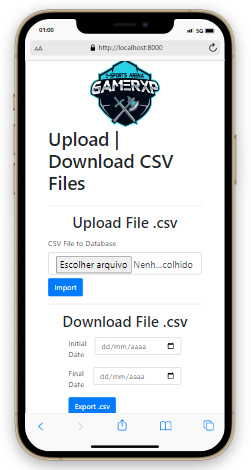
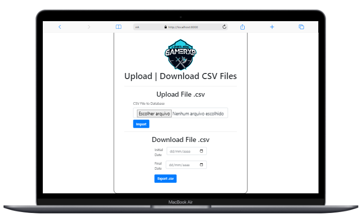

<a id='ancora'></a>
# Projeto Upload | Download CSV Files 🚀

<br><br>

- [Sobre a GamerXP Arena Eventos](#ancora1) <br>
- [Sobre o Projeto](#ancora3) <br>
- [Competências Desenvolvidas](#ancora4) <br>
- [Execução](#ancora7) <br>
- [Prints de Execução](#ancora8) <br>
- [Desenvolvedor](#ancora9)

<br><br>


<a id="ancora1"></a>
## Sobre a GamerXP Arena Eventos 👨🏽‍💻

<br>

GamerXP Arena Eventos é o 1o Espaço Temático de e-Sports do Brasil, localizada em Santos-SP, inaugurada em 2018, recebe Gamers Amadores, SemiPro e ProGamers diariamente. Temos Espaço para Treinamento de Equipes Profissionais de e-Sports e Espaço para Festas e Eventos de Lançamento, Produtos, etc.

<br>

<a id="ancora3"></a>
## Sobre o Projeto ✔️

<br>

### Problema:
O cliente precisa ler um arquivo CSV e guardar as informações em um banco de dados para ser consumido.

### Desafio:
Você precisá criar um programa em PHP no qual leia um arquivo em CSV e guarde os dados no banco de dados. Você também precisará criar uma função para fazer download das linhas da tabela por data (data início e data fim), esse download deverá ser um arquivo CSV.

<br>

<a id="ancora4"></a>
## Competências Desenvolvidas 📝

<br>

* HTML;
* CSS;
* Bootstrap;
* PHP;
* Composer;
* MySQL;

<br>

<a id="ancora7"></a>
## Execução 💻

<br>

- Clone este repositório remoto em seu equipamento:
```
git clone git@github.com:DuAlexandre/gamerxp-challenge.git
```
- Execute o comando:
```
composer install
```
- Implemente o banco de dados com o arquivo `product.sql` localizado na raiz deste diretório; 
- Renomeie o arquivo `.env.example` para `.env` e edite as credenciais do banco de dados;
- Execute o comando para iniciar o servidor PHP: 
```
php -S localhost:8000
```
- Abra a aplicação em seu navegador web:
```
http://localhost:8000
```
<br>

<a id="ancora8"></a>
## Prints de execução 📷

<br>

<center></center>

<br>

<center></center>


<br><br>

<a id="ancora9"></a>
## 🤝 Desenvolvedor:

Projeto desenvolvido por:

<table>
  <tr>
    <td align="center">
      <a href="https://www.linkedin.com/in/eduardo-alexandre025/">
        <br>
        <sub>
          <b>Eduardo Alexandre</b>
        </sub>
      </a>
  </tr>
</table>

<br><br>

[Voltar ao Topo](#ancora)